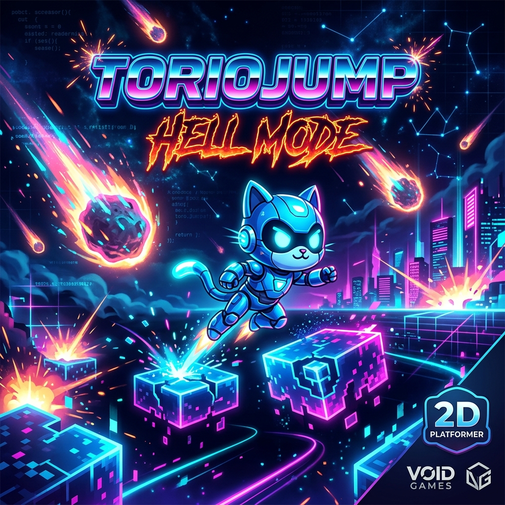

# 🍄 TorioJump - Hell Mode: Doraemon vs Pikachu

**TorioJump - Hell Mode** là một dự án game 2D platformer đỉnh cao, kết hợp giữa phong cách arcade cổ điển và những cơ chế "troll" (Unfair) hiện đại. Đây không chỉ là một trò chơi, mà là một thử thách về sự kiên nhẫn và kỹ năng ngắm bắn chính xác.

---

## 🕹️ Tính năng "Địa Ngục" (Hell Mode Features)

### 🐱 Doraemon & Pikachu Showdown
- **Player (Doraemon)**: Được trang bị **Đại bác không khí (Air Cannon)**. Bạn có thể bắn luồng khí để triệt tiêu đạn của đối thủ.
- **Boss (Pikachu)**: Một xạ thủ điện quang tung ra những **Quả cầu sấm sét vàng (Golden Thunderballs)** đầy uy lực.

### 🐲 Shenron - Sự truy đuổi vĩnh viễn
- **Rồng Thần Shenron**: Xuất hiện ngay từ đầu và **liên tục truy đuổi** người chơi. Chỉ cần một cú chạm nhẹ từ Rồng Thần, bạn sẽ phải bắt đầu lại.
- **Volcano Eruptions**: Cứ mỗi 7 giây, nham thạch sẽ phun trào từ lòng đất, buộc bạn phải liên tục di chuyển và nhảy né.

### ⚙️ Cơ chế tiến hóa súng (Gun Evolution)
- **Exponential Growth**: Mỗi lần bạn chạm vào Cửa Vàng, đạn của Pikachu sẽ **to lên theo cấp số nhân** và bắn nhanh hơn.
- **Homing Bullets**: Ở cấp độ cao, đạn của Pikachu sẽ tự động xoay hướng và đuổi theo bạn cho đến khi trúng đích.

---

## 📊 Hệ thống theo dõi & Kỉ lục
- **Death Counter**: Lưu lại tổng số lần bạn đã hy sinh (được lưu vĩnh viễn qua LocalStorage).
- **Best Goal Record**: Ghi lại số lần chạm cửa liên tiếp nhiều nhất bạn từng đạt được.
- **Rainbow UI**: Các thông báo "Gà quá" xuất hiện với hiệu ứng 7 sắc cầu vồng và rung lắc cực mạnh để tăng thêm phần hưng phấn.

---

## ⌨️ Điều khiển (Controls)

| Phím / Thao tác | Hành động |
| :--- | :--- |
| `A` / `D` | Di chuyển trái / phải |
| `Space` / `W` | Nhảy (Nhấn 2 lần để Nhảy Đôi) |
| **Click Chuột** | **Bắn Đại bác không khí (Air Cannon) về hướng chuột** |
| `B` | Bắn Đại bác không khí về phía trước |
| `R` | Respawn nhanh |

---

## 🛠️ Công nghệ & Đồ họa
- **TypeScript & Vite**: Đảm bảo hiệu suất mượt mà trên nền tảng Web.
- **HTML5 Canvas API**: Toàn bộ nhân vật (Doraemon, Pikachu, Shenron) được vẽ thủ công bằng code Canvas, mang lại sự linh hoạt trong hoạt ảnh.
- **Web Audio API**: Âm thanh và nhạc nền 8-bit được tổng hợp trực tiếp, không cần file audio rời.
- **Glassmorphism UI**: Giao diện đăng nhập và HUD hiện đại, mờ ảo và rực rỡ.

---

## 🚀 Khởi chạy dự án

1. Truy cập thư mục `web-mario`: `cd web-mario`
2. Cài đặt: `npm install`
3. Chạy Server: `npm run dev`
4. Trải nghiệm tại: `http://localhost:5173`

---

## ✍️ Tác giả
Dự án được thực hiện bởi **toilact** với mục tiêu mang lại sự "ức chế" vui vẻ và những giây phút giải trí kịch tính nhất.

**Bạn đã sẵn sàng đối đầu với Pikachu và Rồng Thần chưa? Đừng để bị chê là "Gà Quá" nhé!** 🎮🔥💀
